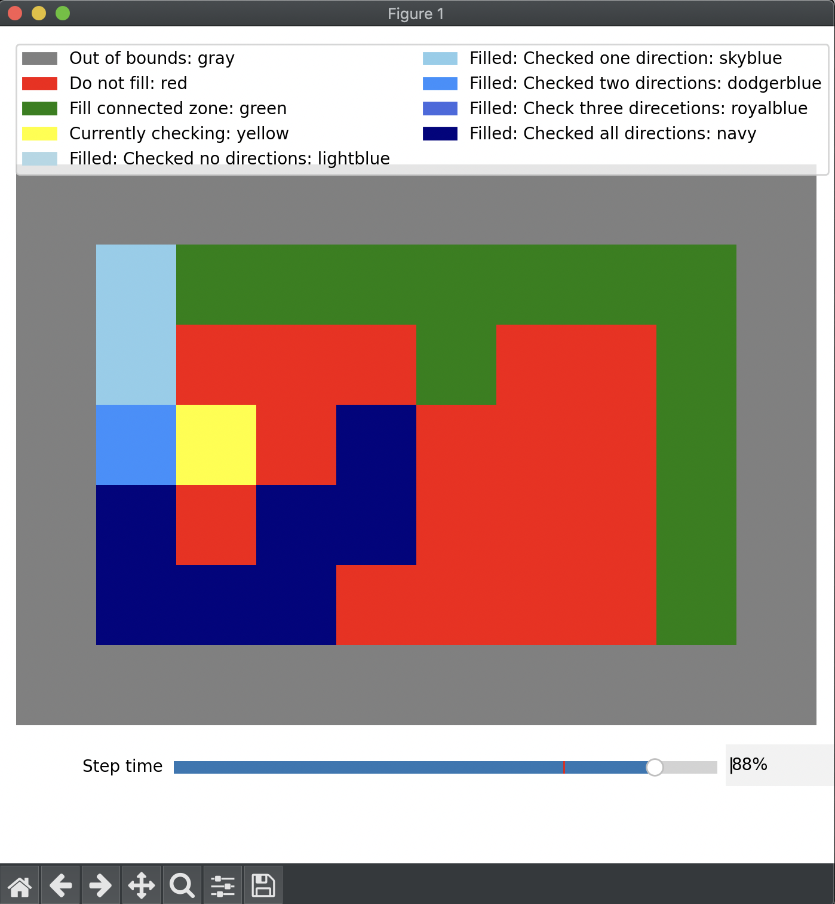

## Flood-Fill-Visualizer 
An educational tool to visualize a recursive function with multiple recursive calls in all directions.
The algorithm checks the current cell, if it is to be filled it fills it and calls the algorithm first on the above cell, when that returns on the below cell, after that recursive call returns on the right cell and finally after the right recursive call returned it calls the algorithm  recursivly on the left cell.

## Dependencies
Python 3.11.7 
matplotlib                3.8.4 
numpy                     1.26.4 
 

## How to run
 
Install Python: If not already installed install Python 3.11.7 (which I used to run this tool) 
try `python --version` or `python3 --version` 
`https://www.python.org/downloads/release/python-3117/` 
 
Download the program: 
`git clone https://github.com/FabianRapp/Flood-Fill-Visualizer.git && cd Flood-Fill-Visualizer` 
 
Set up the enviorment: 
`python3 -m venv flood_fill_env && source flood_fill_env/bin/activate && pip install matplotlib==3.8.4 numpy==1.26.4` 
 
Finally to run the program: 
`python main.py` 
 
To run it again close the windows and use `python main.py` 

## The first window: Setup
Configure the grid by changing cells between being walls or empty spaces, and setting the starting position 
 

 
Green Cells: Space empty space (Cells that can be filled) 
Red Cells: Walls (Cells that can not be filled) 
Yellow Cell: Starting position in cell that can be filled 
Grey Cell: Starting position in cell that can not be filled 

# Controls:
Left click a red cell to turn it green 
Right click a green cell to turn it red 
Left click a green cell to select it as the starting postion 
Right click a red cell to select it as the starting postion (algorithm will fill nothing) 
Instead of clicking individual cells the mouse can be dragged over while the mouse button is held to "click" all the cells passed 
To change the grid size click "New Grid Size" 
 
After you have configured the map press "Start" 

## The second window: Visualization
This window visualizes the recursive execution of the flood fill algorithm in real-time 

This is where the main algorithm runs and is displayed. 
The algorithm works recursively by calling itself first on the above cells, then the below cell, right cell and finally the left cell (in case the current cell is to be filled). 

Move the slider on the bottom the the left for higher speed. 

# The colors:
Green: Empty space (can be filled) 
Red: Wall (can not be filled) 
Yellow: Current postion 
All blue gradiants: Filled cells 
Grey: Boarders 

Darkest blue: the cell is filled and has already called the recusricve call on all it's adjacent cells and all have already returned. 
Lightest blue: the cell is filled and has called one (the above cell) 
Inbetween blue: Filled cell that has called the algorithm on more adjacent cells the darker the blue is 
